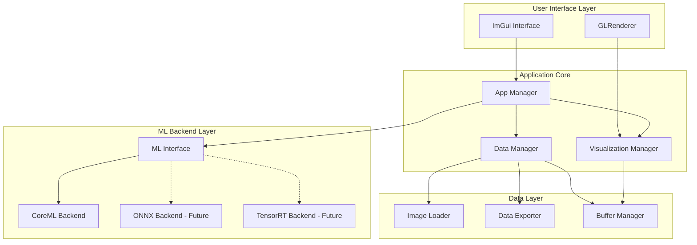
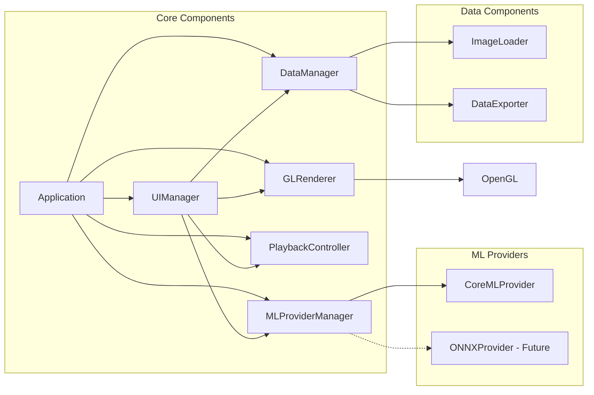
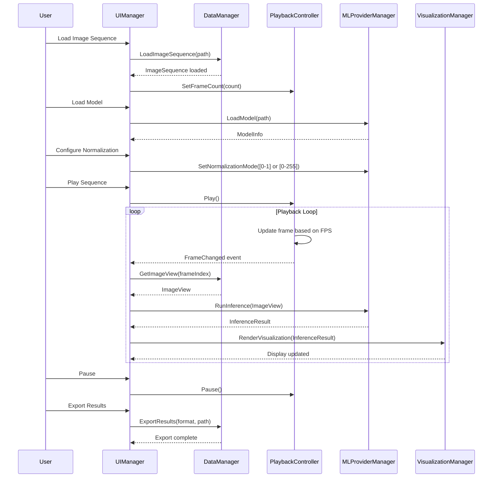

# ThorNativeMLViewer Architecture Document

## Introduction

This document outlines the overall project architecture for ThorNativeMLViewer, including backend systems, shared services, and non-UI specific concerns. Its primary goal is to serve as the guiding architectural blueprint for AI-driven development, ensuring consistency and adherence to chosen patterns and technologies.

**Relationship to Frontend Architecture:**
As a native C++ application using immediate mode GUI (ImGui), this document encompasses both backend and UI concerns in a unified architecture. The immediate mode paradigm integrates UI directly with application logic, making a separate frontend architecture document unnecessary.

### Starter Template or Existing Project

N/A - Greenfield project

### Change Log

| Date | Version | Description | Author |
|------|---------|-------------|--------|
| [Today's Date] | 1.0 | Initial Architecture Document | Winston (Architect) |
| 2024-12-19 | 1.1 | Added binary file format byte ordering specification with little/big endian support | Winston (Architect) |

## High Level Architecture

### Technical Summary

ThorNativeMLViewer is a native desktop application built with C++20 using a modular monolithic architecture. The system leverages OpenGL for high-performance rendering, ImGui for immediate mode UI, and CoreML for initial ML inference capabilities. The architecture emphasizes extensibility through clear interface boundaries, enabling future addition of ML backends (ONNX, TensorRT) while maintaining real-time performance requirements. Pre-allocated buffers and RAII memory management ensure consistent sub-16ms frame times for interactive debugging.

### High Level Overview

1. **Architectural Style**: Modular monolith with plugin-based ML backend system
2. **Repository Structure**: Monorepo containing all application components
3. **Service Architecture**: Single desktop application with internal component separation
4. **Primary Data Flow**: Image Load → Preprocessing → ML Inference → Visualization → Export
5. **Key Decisions**: 
   - Immediate mode GUI for responsive parameter adjustments
   - Plugin architecture for ML backends to support future frameworks
   - Pre-allocated buffers to avoid runtime allocations
   - OpenGL for cross-platform rendering foundation

### High Level Project Diagram



### Architectural and Design Patterns

- **Plugin Architecture:** ML backends implement common interface for easy extension - _Rationale:_ Enables adding ONNX, TensorRT without modifying core code
- **RAII Pattern:** All resource management uses RAII with smart pointers - _Rationale:_ Prevents memory leaks and ensures exception safety
- **Double Buffering:** Separate buffers for processing and display - _Rationale:_ Ensures smooth playback without tearing

## Tech Stack

See [Tech Stack](architecture/tech-stack.md) for details.

## Data Models

### ImageView

**Purpose:** Non-owning view into image data for zero-copy operations

**Key Attributes:**
- data: `std::span<const uint8_t>` or `std::span<const float>` - Non-owning view of pixel data
- width: uint32_t - Image width in pixels
- height: uint32_t - Image height in pixels
- channels: uint32_t - Number of channels (1, 3, or 4)
- stride: size_t - Bytes per row (for alignment)
- pixelType: enum { UINT8, FLOAT32 } - Pixel data type

**Relationships:**
- Created by ImageSequence for frame access
- Consumed by MLBackend for inference
- Referenced by VisualizationManager for display

### ImageSequence

**Purpose:** Owns multi-frame image data with metadata

**Key Attributes:**
- frameData: `std::vector<uint8_t>` or `std::vector<float>` - Contiguous frame storage (raw, unmodified pixel data)
- frameCount: `uint32_t` - Number of frames
- width: `uint32_t` - Frame width in pixels
- height: `uint32_t` - Frame height in pixels
- channels: `uint32_t` - Number of channels per frame
- pixelType: `ImageDataType` - UINT8 or FLOAT32
- fps: `float` - Playback framerate

**Design Note:** Scale and bias transformations are applied during rendering via GLSL shaders, not during data loading or storage. This preserves data integrity and enables real-time parameter adjustments.

**Binary Format Note:** Raw pixel data is stored in little-endian byte ordering (MVP default, no file header). See DataManager Binary File Format Specification for implementation details.

**Relationships:**
- Loaded by ImageLoader
- Provides ImageView for individual frames
- Managed by DataManager

### Tensor

**Purpose:** Multi-dimensional array for ML data interchange

**Key Attributes:**
- data: `std::vector<float>` - Tensor data (always float32)
- shape: `std::vector<int64_t>` - Tensor dimensions
- strides: `std::vector<int64_t>` - Stride for each dimension
- dtype: `TensorDataType` - Always FLOAT32 for MVP

**Relationships:**
- Created from ImageView for ML input
- Returned by MLBackend as output
- Used by DataExporter for NPY format

### MLModel

**Purpose:** Abstract representation of loaded ML model

**Key Attributes:**
- modelPath: `std::filesystem::path` - Path to model file
- inputShape: `std::vector<int64_t>` - Expected input dimensions
- outputShape: `std::vector<int64_t>` - Output dimensions
- inputNormalization: `NormalizationMode` - Model input normalization settings (e.g., [0-255] to [0-1])
- name: `std::string` - Model name
- description: `std::string` - Model description
- version: `std::string` - Model version
- metadata: `std::unordered_map<string, string>` - Additional model-specific metadata

**Relationships:**
- Implemented by CoreMLModel concrete class
- Managed by MLBackendManager
- Queried by UI for configuration display

### InferenceResult

**Purpose:** Encapsulates model inference output with support for multiple output types

**Key Attributes:**
- tensors: `std::unordered_map<std::string, Tensor>` - Named output tensors
- interpretations: `std::unordered_map<std::string, std::unique_ptr<TensorInterpretation>>` - How to interpret each tensor
- elapsedTime: `Duration` - Inference duration

**Relationships:**
- Produced by MLBackend implementations
- Consumed by VisualizationManager
- Exported by DataExporter

### TensorInterpretation Types

**Purpose:** Base class hierarchy for different model output interpretations

**Base Class:**
```cpp
class TensorInterpretation {
public:
    virtual ~TensorInterpretation() = default;
    virtual InterpretationType type() const = 0;
};
```

**Derived Types:**
- **GenericInterpretation:** Default fallback for unknown tensor types
- **ClassificationInterpretation:**
  - labels: `std::vector<std::string>` - Class names
  - softmax_applied: `bool` - Whether outputs are already probabilities
- **ObjectDetectionInterpretation:**
  - format: BoxFormat enum { XYXY, XYWH, CXCYWH } - Bounding box format
  - num_classes: `int` - Number of object classes
  - class_names: `std::vector<std::string>` - Names for each class
  - confidence_threshold: float - Minimum confidence for display

## Components

### Application

**Responsibility:** Main application lifecycle and coordination between components

**Key Interfaces:**
- Initialize() - Setup all subsystems
- Run() - Main application loop
- Shutdown() - Clean termination

**Dependencies:** All major components

**Technology Stack:** C++20, OpenGL context management

### UIManager

**Responsibility:** ImGui interface setup, event handling, and visualization widgets

**Key Interfaces:**
- RenderUI() - Draw all UI elements including charts
- HandleInput() - Process user input
- ShowErrorDialog() - Error presentation

**Dependencies:** ImGui, Application, all data managers

**Technology Stack:** Dear ImGui, OpenGL

### MLProviderManager

**Responsibility:** Manages ML provider plugins and model lifecycle

**Key Interfaces:**
- LoadModel(path) - Load model file
- RunInference(imageView) - Execute model
- GetAvailableProviders() - List plugins
- RegisterProvider(provider) - Add new ML framework

**Dependencies:** ML provider implementations

**Technology Stack:** C++20 abstract interfaces, dynamic loading

### DataManager

**Responsibility:** Coordinates data loading and export

**Key Interfaces:**
- LoadImageSequence(path) - Load multi-frame data
- ExportResults(format, path) - Save outputs
- GetImageView(frameIndex) - Get view of specific frame

**Dependencies:** ImageLoader, DataExporter

**Technology Stack:** C++20 filesystem, custom NPY writer

#### Binary File Format Specification

**MVP Byte Ordering:**
- **Default**: Little-endian byte ordering (specified programmatically, not in file)
- **No File Header**: Raw binary data only, dimensions and pixel type provided via API parameters
- **Future**: Big-endian support can be added post-MVP via LoadImageSequence parameter

**Byte Extraction Implementation:**
```cpp
// Little-endian 32-bit integer extraction (MVP default)
uint32_t extractLittleEndian32(const uint8_t* data) {
    return (data[0]<<0) | (data[1]<<8) | (data[2]<<16) | (data[3]<<24);
}

// Big-endian 32-bit integer extraction (future extension)
uint32_t extractBigEndian32(const uint8_t* data) {
    return (data[3]<<0) | (data[2]<<8) | (data[1]<<16) | (data[0]<<24);
}
```

**Float32 Handling:**
- Read as 32-bit integers using little-endian extraction, then reinterpret as float32
- Maintain bit-exact representation during conversion
- Preserve NaN and infinity values correctly

**File Structure (MVP):**
- No header or metadata
- Raw pixel values in little-endian byte order
- Dimensions (width, height, channels) and pixel type provided via LoadImageSequence() parameters
- File size validation: `expected_size = width * height * channels * sizeof(pixel_type) * frame_count`

### PlaybackController

**Responsibility:** Controls playback state and current frame selection

**Key Interfaces:**
- Play() - Start playback
- Pause() - Stop playback
- SetFrame(index) - Jump to specific frame
- GetCurrentFrame() - Get current frame index
- SetFPS(fps) - Set playback speed

**Dependencies:** None (observed by other components)

**Technology Stack:** C++20 std::chrono for timing

### GLRenderer

**Responsibility:** Low-level OpenGL rendering operations and texture management with shader-based image processing

**Key Interfaces:**
- CreateTexture(imageView) - Create OpenGL texture from image
- UpdateTexture(id, imageView) - Update existing texture
- RenderTexturedQuad(scale, bias) - Draw image to screen with shader-based scale/bias
- SetRenderingParameters(scale, bias) - Configure shader uniforms for image display
- Initialize() - Setup OpenGL state

**Dependencies:** OpenGL via GLFW headers

**Technology Stack:** OpenGL 3.3, GLSL shaders with scale/bias uniforms

### Component Diagrams



## External APIs

N/A - This is a standalone desktop application with no external API integrations. All ML inference runs locally using embedded frameworks.

## Core Workflows



## REST API Spec

N/A - Desktop application with no REST API

## Database Schema

N/A - No database required. All data is processed in-memory with file-based input/output.

## Source Tree

See [Source Tree](architecture/source-tree.md) for details.

## Infrastructure and Deployment

### Infrastructure as Code

- **Tool:** N/A - Desktop application
- **Location:** N/A
- **Approach:** Local installation only

### Deployment Strategy

- **Strategy:** Direct binary distribution via local build
- **CI/CD Platform:** Local build scripts
- **Pipeline Configuration:** `scripts/build.sh`

### Environments

- **Development:** Local developer machine - macOS 11.0+ with Xcode
- **Testing:** Local machine testing - Manual verification
- **Production:** End-user machines - Distributed as .app bundle

### Environment Promotion Flow

```text
Developer Machine → Local Build → Local Test → Package (.app) → Manual Distribution
```

### Rollback Strategy

- **Primary Method:** Previous version download
- **Trigger Conditions:** Critical bugs or crashes
- **Recovery Time Objective:** < 1 hour (user downloads previous version)

## Error Handling Strategy

### General Approach

- **Error Model:** C++ exceptions for recoverable errors, assertions for logic errors
- **Exception Hierarchy:** Custom exception classes derived from std::exception
- **Error Propagation:** Exceptions caught at UI boundary and displayed to user

### Logging Standards

- **Library:** fmt + custom logger
- **Format:** `[{timestamp}] [{level}] [{component}] {message}`
- **Levels:** ERROR, WARN, INFO, DEBUG

### Error Handling Patterns

#### External API Errors

- **Retry Policy:** N/A (no external APIs)
- **Circuit Breaker:** N/A
- **Timeout Configuration:** N/A
- **Error Translation:** N/A

#### Business Logic Errors

- **Custom Exceptions:** `ModelLoadError`, `InferenceError`, `DataFormatError`
- **User-Facing Errors:** Clear messages via ImGui dialogs

## Coding Standards

See [Coding Standards](architecture/coding-standards.md) for details.

## Test Strategy and Standards

### Testing Philosophy

- **Approach:** Test-driven development for core components
- **Test Pyramid:** Many unit tests, some integration tests, minimal UI tests

### Test Types and Organization

#### Unit Tests

- **Framework:** GoogleTest 1.14+
- **File Convention:** `test_<source_file>.cpp`
- **Location:** `tests/` mirroring source structure
- **Mocking Library:** GoogleMock for interfaces

**AI Agent Requirements:**
- Generate tests for all public methods
- Cover edge cases and error conditions
- Follow AAA pattern (Arrange, Act, Assert)
- Mock all external dependencies

#### Integration Tests

- **Scope:** Component interaction testing
- **Location:** `tests/integration/`
- **Test Infrastructure:**
  - **File System:** Temp directory fixtures
  - **OpenGL:** Headless EGL context
  - **CoreML:** Mock model files

#### End-to-End Tests

- **Framework:** Custom UI automation helpers
- **Scope:** Critical user workflows only
- **Environment:** Local developer machine
- **Test Data:** Synthetic test images and models

### Test Data Management

- **Strategy:** Fixtures with known outputs
- **Fixtures:** `tests/fixtures/` directory for unit test fixtures
- **Sample Data:** `data/samples/` directory for integration test sequences
- **Test Models:** `data/models/` directory for CoreML test models
- **Factories:** Test data builders for complex objects
- **Cleanup:** Automatic via RAII test fixtures

### Continuous Testing

- **CI Integration:** Local test scripts (`scripts/run_tests.sh`)
- **Performance Tests:** Manual benchmark runs
- **Security Tests:** Static analysis with clang-tidy (local)

## Checklist Results Report

Awaiting validation. Please run the architect-checklist to validate this architecture document.

## Next Steps

### Architect Prompt

With this architecture complete, the development team can begin implementation. The modular design supports the one-week MVP timeline while establishing patterns for future expansion. Key implementation priorities:

1. Set up CMake build system with vcpkg
2. Implement BufferManager for memory efficiency  
3. Create MLBackend interface and CoreML implementation
4. Build visualization pipeline with OpenGL/ImGui
5. Implement data loading and export functionality

The architecture provides clear boundaries between components, enabling parallel development and easy testing of individual modules.